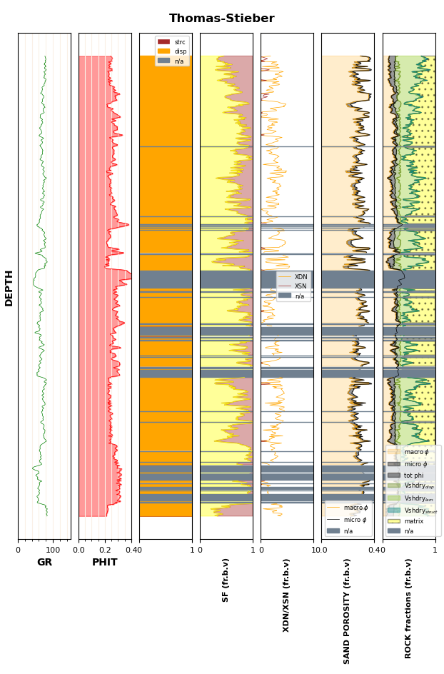

# Thomas-stieber analysis of thinly laminated sands
Code to perform Thomas-Stieber calculations for thinly laminated sands according to the 1975 paper.

To run the code, a GR and PHIT curve are necessary. Parameters are defined in the configs/notebook_configs.yaml file
(read docstrings for format)
At a minimum, the "clean sand" and "laminated shale" endpoints need to be defined (by GR resp PHIT). The "dispersed shale" 
and "structural shale" endpoints are calculated from the clean sand and laminated shale endpoints. 

The results calculated are: 
- sand fraction (SF): the fraction of laminated sand (--> the fraction of laminated shale = 1 - SF)
- (normalized) dispersed shale (XDN): the fraction of pore space (0-1) occupied by dispersed shale
- (normalize) structural shale (XSN): the fraction of structural shale (fraction of matrix) 
 ...and from these, the following "wet" shale fractions: 
- laminated wet shale volume (vsh_wet_lam): the volume fraction of laminated wet shale
- structural wet shale volume (vsh_wet_struct): the volume fraction of structural wet shale
- dispersed wet shale volume (vsh_wet_disp): the volume fraction of dispersed wet shale
- total wet shale volume (vsh_wet_total): the total volume fraction of wet shale (=vsh_wet_lam+vsh_wet_struct+vsh_wet_disp) 
 ...and the "dry" counterparts:
- laminated dry shale volume (vsh_wet_lam): the volume fraction of laminated dry shale
- structural dry shale volume (vsh_wet_struct): the volume fraction of structural dry shale
- dispersed dry shale volume (vsh_wet_disp): the volume fraction of dispersed dry shale
- total dry shale volume (vsh_wet_total): the total volume fraction of dry shale (=vsh_dry_lam+vsh_dry_struct+vsh_dry_disp)

In addition to the calculated results, two graphics can be generated for the analysis:
1. a Thomas-Stieber cross plot with the envelopes/endpoints on there:

2. a CPI with the input curves (GR and PHIT) and all results:

